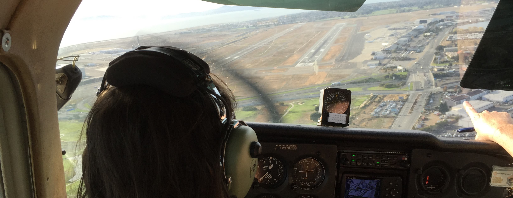

<div class="container">
  <h1>Flight<div class="hi"></img></div> Visualizer</h1>
  </img>
</div>

## Description

Uses data retrieved using [AeroAPI] to create a [KML]
([Keyhole Markup Language](https://en.wikipedia.org/wiki/Keyhole_Markup_Language))
visualization of a flight, enabling it to be "played back" in a KML client renderer
such as [Google Earth].

All that's needed to identify (a) flight(s) to [AeroAPI] is an aircraft's "tail number," and optionally
a "cutoff time" prior to which to consider.  If no "cutoff time" is given, the current time will be used.

## Packaging

Flight Visualizer is packaged into a standalone CLI command named `fviz`.

## Building From Source or Contributing

The "home" source control repository of Flight Visualizer is on GitHub at
[noodnik2/flightvisualizer](https://github.com/noodnik2/flightvisualizer). 
It was written in, and leverages some relatively recent features of [golang](https://go.dev/).
Its initial test suite uses `go1.20.2 darwin/amd64`, though it should work on comparable
distributions of `go` as well.

On a fresh clone / fork of the repository, you should be able to...

<details>
  <summary><code>$ make clean update build test</code></summary>

```shell
$ make clean update build test
rm -rf vendor dist tmp
go mod tidy
go mod download
go mod vendor
go build -o dist/fviz .
go test ./...
ok      github.com/noodnik2/flightvisualizer/internal/aeroapi   0.211s
ok      github.com/noodnik2/flightvisualizer/internal/kml       0.320s
ok      github.com/noodnik2/flightvisualizer/pkg/aeroapi        0.372s
```
</details>

## Setup / Configuration

In order to retrieve flight information using [AeroAPI], you'll need to obtain and install an API Key.
See the [AeroAPI] documentation to learn more about this.

Once you have your API Key:
1. Copy the supplied [`./.env.local.template`](./.env.local.template) template file to `.env.local` in the folder from which you run `fviz`
2. Set the value of the `AEROAPI_API_KEY` configuration parameter in `.env.local`

Once you've done this, you'll be good to go.  Just remember to protect this `.env.local` file going forward, as it contains a secret.

### The `artifacts` Folder

By default, `fviz` assumes the artifacts it reads & writes should be located in a folder named `artifacts`, nested within the current
directory.  Therefore, you should always have such a sub-folder underneath the current directory when running `fviz`.  Alternatively,
you can use the `--artifactsDir` option to specify the location for artifacts each time you invoke `fviz`.

## Example Invocations

Some example invocations of `fviz` are presented below to help jumpstart the uninitiated user.
Additional use cases can be revealed through exploration of the complete set of options available.
Running the command without options, or with an incomplete set of options, reveals the set of available options. 

### Simple Case 

In this simple case, default KML visualizations are created for the most recent flights available via AeroAPI
for tail number [N335SP](https://flightaware.com/live/flight/N335SP) (BTW, [Maui Aviators](https://www.mauiaviators.com/)
is an ultra-cool place to visit the next time you're in Maui 👍👍), and the most recent one is launched right away into
[Google Earth Pro] (assuming it's registered to open `.kmz` files in your operating system).

<details>
  <summary><code>$ fviz tracks --tailNumber N335SP --launch</code></summary>

```shell
$ fviz tracks --tailNumber N335SP --launch
2023/05/23 17:33:48 INFO: requesting from endpoint(/flights/N335SP)
2023/05/23 17:33:49 INFO: requesting from endpoint(/flights/N335SP-1684874159-adhoc-1864p/track)
2023/05/23 17:33:49 INFO: requesting from endpoint(/flights/N335SP-1684868329-adhoc-760p/track)
2023/05/23 17:33:49 INFO: requesting from endpoint(/flights/N335SP-1684796443-adhoc-635p/track)
2023/05/23 17:33:50 INFO: requesting from endpoint(/flights/N335SP-1684787435-adhoc-1467p/track)
2023/05/23 17:33:50 INFO: writing 4 camera,path,vector KML document(s)
```
</details>

### More Options

Another example leverages more of the available options, including:
- `--cutoffTime` - target a particular flight within the history (e.g., not just the latest available)
- `--flightCount` - limit the number of most recent flight(s) for which to produce visualizations
- `--saveArtifacts` - save responses obtained from AeroAPI in order to re-use them later (e.g., with different KML generation options, etc.)
- `--artifactsDir` - specify where "artifacts" are read/written (defaults to `artifacts')
- `--layers ` - specify the visualization "layer(s)" to include in the KML document(s) (e.g., `camera,path,vector`)
- `--verbose` - generate more detailed runtime logging to help understand what's happening

<details>
  <summary><code>$ fviz tracks --tailNumber N6189Q --cutoffTime 2023-05-18T20:40:00-04:00 --flightCount 3 --saveArtifacts --artifactsDir /tmp/myflight --layers camera,path,vector --verbose</code></summary>

```shell
$ fviz tracks --tailNumber N6189Q --cutoffTime 2023-05-18T20:40:00-04:00 --flightCount 3 --saveArtifacts --artifactsDir /tmp/myflight --layers camera,path,vector --verbose
2023/05/23 19:04:35 INFO: requesting from endpoint(/flights/N6189Q?&end=2023-05-18T20:40:00-04:00)
2023/05/23 19:04:35 INFO: saving to file(/tmp/myflight/fvf_N6189Q_cutoff_20230518T204000-0400.json)
2023/05/23 19:04:35 INFO: requesting from endpoint(/flights/N6189Q-1684452005-adhoc-1107p/track)
2023/05/23 19:04:36 INFO: saving to file(/tmp/myflight/fvt_N6189Q-1684452005-adhoc-1107p.json)
2023/05/23 19:04:36 INFO: requesting from endpoint(/flights/N6189Q-1684113448-adhoc-1454p/track)
2023/05/23 19:04:36 INFO: saving to file(/tmp/myflight/fvt_N6189Q-1684113448-adhoc-1454p.json)
2023/05/23 19:04:36 INFO: requesting from endpoint(/flights/N6189Q-1684108895-adhoc-1665p/track)
2023/05/23 19:04:36 INFO: saving to file(/tmp/myflight/fvt_N6189Q-1684108895-adhoc-1665p.json)
2023/05/23 19:04:36 INFO: writing 3 camera,path,vector KML document(s)
2023/05/23 19:04:36 INFO: saving(/tmp/myflight/fvk_N6189Q-230518233039Z-9003450Z-camera,path,vector.kmz)
2023/05/23 19:04:36 INFO: saving to file(/tmp/myflight/fvk_N6189Q-230518233039Z-9003450Z-camera,path,vector.kmz)
2023/05/23 19:04:36 INFO: saving(/tmp/myflight/fvk_N6189Q-230515011723Z-2559Z-camera,path,vector.kmz)
2023/05/23 19:04:36 INFO: saving to file(/tmp/myflight/fvk_N6189Q-230515011723Z-2559Z-camera,path,vector.kmz)
2023/05/23 19:04:36 INFO: saving(/tmp/myflight/fvk_N6189Q-230515001513Z-11208Z-camera,path,vector.kmz)
2023/05/23 19:04:36 INFO: saving to file(/tmp/myflight/fvk_N6189Q-230515001513Z-11208Z-camera,path,vector.kmz)
```

</details>

In the example above, Google Earth KML visualizations of the three flights prior to the given "cutoff date"
for the given aircraft (identified by its "tail number"), with three "visualization layers" that can be toggled
on/off from within Google Earth: 
- Camera (first-person perspective)
- Path (3D flight path appears)
- Vector (A "vector" visualization of performance data)

### (Re-) Converting Saved AeroAPI Into KML

An important use case for development or support of Flight Visualizer application is to (re-) convert
already retrieved responses from AeroAPI into KML (e.g., to avoid making unnecessary calls to the API).

This can be accomplished by using the `--fromArtifacts` option, pointing it to the file created by the
`--saveArtifacts` option in which AeroAPI's response from the `/flights/{tailNumber}` REST API call is
recorded; e.g.:

```shell
$ fviz tracks --fromArtifacts artifacts/fvf_N6189Q_cutoff_20230518T204000-0400.json
```

## Enjoying Visualizations

While [KML] is a standard "Markup Language," and is supported by many other geospatial applications (perhaps most
notably [Google Maps], [QGIS] and [ArcGIS Earth]), only [Google Earth] (as of this writing) appears to best support
"live touring" visualizations (e.g., from the "first person" perspective).  Accordingly, it's been the preferred
target client for rendering the visualizations generated by Flight Visualizer.

By default, Flight Visualizer creates a `.kmz` file (compressed KML file), that can be rendered successfully
by [Google Earth Web], [Google Earth Pro] and [Google Maps].

Be sure to see how enabling and disabling visualization of each of the "layers" independently can be used to
produce different and interesting perspectives.

## Watching Your Bill

Queries to AeroAPI cost money.  [This page](https://flightaware.com/aeroapi/portal/usage) is one to keep
an eye on while making active use of it.

## See Also

If you like this type of thing and are a user of [Microsoft Flight Simulator], be sure to check out a
related project that uses KML to produce visualizations _(including in real-time!)_ of simulated flights
in [Google Earth]:
- [MSFS2020 Pilot Path Recorder](https://github.com/noodnik2/MSFS2020-PilotPathRecorder) and related pages:
  - [LiveCam Support](https://github.com/noodnik2/MSFS2020-PilotPathRecorder/blob/master/README-kmlcam.md) 
  - [LiveCam Q&A](https://github.com/noodnik2/MSFS2020-PilotPathRecorder/blob/master/README-kmlcam-QandA.md)


[AeroAPI]: https://flightaware.com/commercial/aeroapi
[KML]: https://developers.google.com/kml
[Google Earth]: https://www.google.com/earth/versions
[Google Earth Web]: https://www.google.com/earth/versions/#earth-for-web
[Google Earth Pro]: https://www.google.com/earth/versions/#earth-pro
[Google Maps]: https://www.google.com/maps
[ArcGIS Earth]: https://www.esri.com/en-us/arcgis/products/arcgis-earth
[QGIS]: https://qgis.org
[KML]: https://www.ogc.org/standard/kml
[Microsoft Flight Simulator]: https://www.flightsimulator.com

<style>
  @keyframes hi  {
      0% { transform: rotate( 0.0deg) }
     10% { transform: rotate(14.0deg) }
     20% { transform: rotate(-8.0deg) }
     30% { transform: rotate(14.0deg) }
     40% { transform: rotate(-4.0deg) }
     50% { transform: rotate(10.0deg) }
     60% { transform: rotate( 0.0deg) }
    100% { transform: rotate( 0.0deg) }
  }

  @keyframes gradient {
    0% {
      background-position: 0 50%;
    }
    50% {
      background-position: 100% 50%;
    }
    100% {
      background-position: 0 50%;
    }
  }

  .container {
    --color-main: #5452ee;
    --color-primary: #e73c7e;
    --color-secondary: #23a6d5;
    --color-tertiary: #ffff;

    background: linear-gradient(-45deg, var(--color-main), var(--color-primary), var(--color-secondary), var(--color-tertiary));

    background-size: 400% 400%;
    animation: gradient 15s ease infinite;

    width: 100%;
    height: 10em;
    padding: 0.25em;

    display: flex;
    color: white;

    font-family: -apple-system, BlinkMacSystemFont, "Segoe UI", Roboto, Helvetica, Arial, sans-serif, "Apple Color Emoji", "Segoe UI Emoji", "Segoe UI Symbol";
  }

  .right {
    display: block;
    margin-left: auto;
    margin-right: 0;
  }

  .hi {
    animation: hi 1.5s linear -0.5s infinite;
    display: inline-block;
    transform-origin: 70% 70%;
  }

  h1 {
      padding-left: 0.5em;
      padding-bottom: 0.25em;
  }

  @media (prefers-color-scheme: light) {
    .container {
      --color-main: #F15BB5;
      --color-primary: #24b0ef;
      --color-secondary: #4526f6;
      --color-tertiary: #f6f645;
    }
  }

  @media (prefers-reduced-motion) {
    .container {
      animation: none;
    }

    .hi {
      animation: none;
    }
  }
</style>
