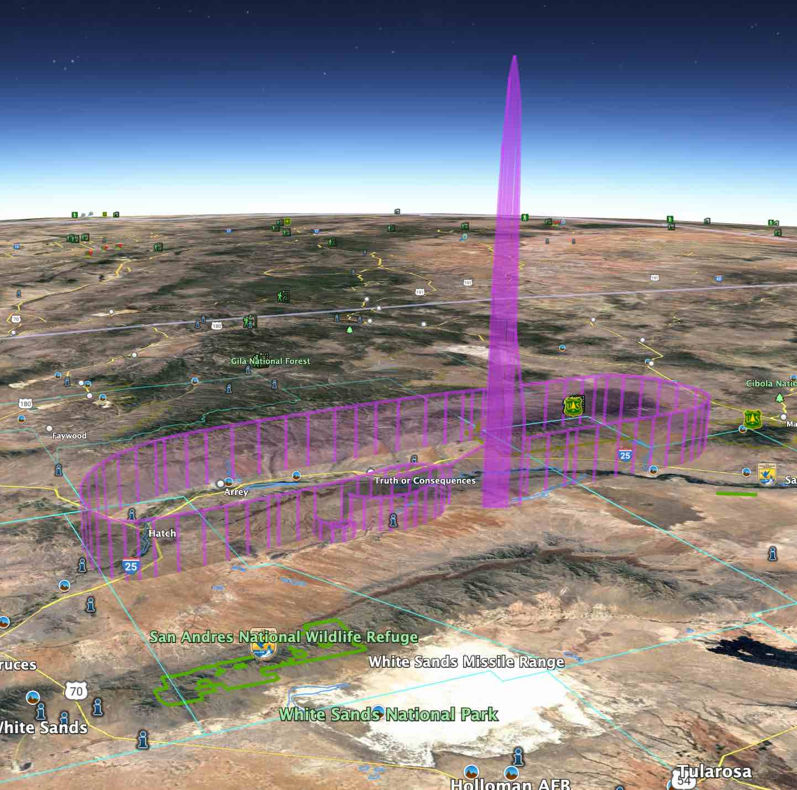

# Flight  Visualizer

## Summary

Flight Visualizer is a versatile command-line application designed to transform flight data obtained from
[AeroAPI] into dynamic visualizations using the Keyhole Markup Language ([KML]). This tool enables users to
replay flights in KML client renderers such as [Google Earth]. 

By providing either a unique "flight identifier" or an aircraft's "tail number" and time frame,
users can visualize flights' paths and performance data. The software offers options for various
visualization "layers," including camera perspective, 3D flight paths and performance vectors.
The generated KML files can be easily shared and explored, offering a comprehensive and immersive
way to analyze and (re-) experience flight trajectories and characteristics.

## Description

Uses data retrieved using [AeroAPI] to create a [Keyhole Markup Language] ([KML]) visualization of a flight,
enabling it to be "played back" in a KML client renderer such as [Google Earth].

All that's needed to identify (a) flight(s) to [AeroAPI] is an aircraft's "tail number," and optionally
a "cutoff time" prior to which to consider.  If no "cutoff time" is given, the current time will be used.

See [Installation](#installation) below to get started.

### Example

```shell
$ fviz tracks --tailNumber N8050J --cutoffTime 2023-05-22T19:45:00-04:00 --launch
$ fviz tracks --tailNumber N81497 --flightCount 1 --launch
```

## Featured Flights

Articles about "Featured Flights" can be found in the [featured](./docs/featured) folder:

<details>
  <summary>Virgin Galactic 02 Spaceflight</summary>

> See [this write-up](docs/featured/galactic02.md) about a visualization of
> [Galactic 02], the second commercial spaceflight of the American aerospace
> company [Virgin Galactic].
> 
> 
</details>

## Setup & Usage

Follow the instructions in the sections below to install, configure and invoke the flight visualizer tool.

### Installation

Flight Visualizer is packaged into a standalone CLI command named `fviz`.
Installing flight visualizer is simply a matter of copying its executable binary
(e.g., `fviz` or `fviz.exe` in Windows) from the release distribution into a location
from which it can be invoked (e.g., a folder within your `PATH`, etc.)    

Everything needed is contained in the single binary which is pre-built for popular operating systems
and included in the standard [Releases](https://github.com/noodnik2/flightvisualizer/releases).

### Configuration
In order to retrieve flight information using [AeroAPI], you'll need to obtain and install an API Key.
See the [AeroAPI] documentation to learn more about this.

Flight Visualizer stores and accesses your AeroAPI API Key in its configuration, which is normally stored
in the file `.config/fviz` located underneath your `HOME` directory.  You can set the environment variable
`FVIZ_CONFIG_FILE` to point to a different file, if needed.  Also, each configuration property can be 
overridden by setting it as an environment variable prior to invocation of Flight Visualizer.

You can use your own editor or the `config edit` sub-command to create and modify the properties in Flight
Visualizer's configuration file.  Here's an example file (with secrets removed:)

```shell
$ cat ~/.config/fviz
AEROAPI_API_URL=https://aeroapi.flightaware.com/aeroapi
ARTIFACTS_DIR=.
VERBOSE=false
AEROAPI_API_KEY=YourAeroApiKeySecretGoesHere
$ █
```

The console log below illustrates how using `fviz config edit` steps through each configuration item,
showing its current value, and giving an opportunity to change it:
```shell
$ fviz config edit
2023/06/02 15:54:26 editing '/Users/johnny/.config/fviz':
AEROAPI_API_URL: https://aeroapi.flightaware.com/aeroapi
ARTIFACTS_DIR: .
VERBOSE: (Use the arrow keys to navigate: ↓↑) 
▸ False
  True
AEROAPI_API_KEY: *******************************
Done? [y/N] y
$ █
```

### Invocation

The typical example invocation scenarios provides below and in the linked documentation should provide
a generally good idea of how to invoke the `fviz` (Flight Visualizer) command.  When in doubt, use the
`--help` option to retrieve a syntax digram, e.g.:

<details>
  <summary><code>$ fviz --help</code></summary>

```shell
Generates visualizations of flight data

Usage:
  fviz [flags]
  fviz [command]

Available Commands:
  config      Shows current configuration
  help        Help about any command
  tracks      Visualizes flight tracks

Flags:
  -d, --debug     Enables 'debug' operation
  -h, --help      help for dist/macos/fviz
  -v, --verbose   Enables 'verbose' operation
      --version   version for dist/macos/fviz

Use "dist/macos/fviz [command] --help" for more information about a command.
```
</details>

Or, to get the options available for the `tracks` (main) subcommand (for example)...

<details>
  <summary><code>$ fviz tracks --help</code></summary>

```shell
Generates KML visualizations of flight track logs retrieved from FlightAware's AeroAPI

Usage:
  fviz tracks [flags]

Flags:
  -a, --artifactsDir string    Directory to save or load artifacts
  -t, --cutoffTime string      Cut off time for flight(s) to consider
  -c, --flightCount int        Count of (most recent) flights to consider (0=unlimited)
  -i, --flightNumber string    Flight number identifier
  -f, --fromArtifacts string   Use saved responses instead of querying AeroAPI
  -h, --help                   help for tracks
  -o, --launch                 Open the KML visualization of the most recent flight retrieved
  -l, --layers string          Layer(s) of the KML depiction to create (default "camera,path,vector")
  -b, --noBanking              Disable banking heuristic calculations
  -s, --saveArtifacts          Save responses from AeroAPI requests
  -n, --tailNumber string      Tail number identifier
      --version                version for tracks

Global Flags:
  -d, --debug     Enables 'debug' operation
  -v, --verbose   Enables 'verbose' operation
```
</details>

#### The `artifacts` Folder

By default, `fviz` assumes the artifacts it reads & writes should be located in the directory specified in
its `ARTIFACTS_DIR` configuration property. You can override this per-invocation using the `--artifactsDir`
option to specify the location for artifacts each time you invoke `fviz`.

#### Example Invocations

Examples of typical invocations of `fviz` are presented below to help jumpstart the uninitiated user.
Additional use cases can be revealed through exploration of the complete set of options available.
Running the command with the `--help` option will reveal the complete set of available options. 

##### Simple Case 

In this simple case, default [KML] visualizations are created for the (at the time) most recent flights available
via [AeroAPI] for tail number `N335SP`, and the most recent one  is launched right away into [Google Earth Pro],
which was registered to open [.kmz] files in the operating system.
- If you'd like to take a virtual tour around the perimeter of Maui, consider visualizing this flight yourself
  by loading [the output file](./artifacts/fvk__230523203550Z-22102Z_camera-path-vector.kmz) into a KML
  client such as [Google Earth] ([Google Maps] isn't recommended since most of this flight is over water 😉).
- _BTW, [N335SP](https://flightaware.com/live/flight/N335SP) is operated by [Maui Aviators](https://www.mauiaviators.com/)
  which I've found to be an ultra-cool FBO for flight instruction, or to get checked out, for some aerial
  adventures when visiting Maui 🤙👍_

<details>
  <summary><code>$ fviz tracks --tailNumber N335SP --launch</code></summary>

```shell
$ fviz tracks --verbose --tailNumber N335SP --launch
2023/05/23 17:33:48 INFO: requesting from endpoint(/flights/N335SP)
2023/05/23 17:33:49 INFO: requesting from endpoint(/flights/N335SP-1684874159-adhoc-1864p/track)
2023/05/23 17:33:49 INFO: requesting from endpoint(/flights/N335SP-1684868329-adhoc-760p/track)
2023/05/23 17:33:49 INFO: requesting from endpoint(/flights/N335SP-1684796443-adhoc-635p/track)
2023/05/23 17:33:50 INFO: requesting from endpoint(/flights/N335SP-1684787435-adhoc-1467p/track)
2023/05/23 17:33:50 INFO: writing 4 camera,path,vector KML document(s)
```
</details>

##### More Options

Another example leverages more of the available options, including:
- `--cutoffTime` - target a particular flight within the history (e.g., not just the latest available)
- `--flightCount` - limit the number of most recent flight(s) for which to produce visualizations
- `--saveArtifacts` - save responses obtained from [AeroAPI] in order to re-use them later (e.g., with different KML generation options, etc.)
- `--artifactsDir` - specify where "artifacts" are read/written (i.e., instead of configured `ARTIFACTS_DIR`)
- `--layers ` - specify the visualization "layer(s)" to include in the [KML] document(s) (e.g., `camera,path,vector`)
- `--verbose` - generate more detailed runtime logging to help understand what's happening

<details>
  <summary><code>$ fviz tracks --tailNumber N6189Q --cutoffTime 2023-05-18T20:40:00-04:00 --flightCount 3 --saveArtifacts --artifactsDir /tmp/myflight --layers camera,path,vector --verbose</code></summary>

```shell
$ fviz tracks --tailNumber N6189Q --cutoffTime 2023-05-18T20:40:00-04:00 --flightCount 3 --saveArtifacts --artifactsDir /tmp/myflight --layers camera,path,vector --verbose
2023/05/23 19:04:35 INFO: requesting from endpoint(/flights/N6189Q?&end=2023-05-18T20:40:00-04:00)
2023/05/23 19:04:35 INFO: saving to file(/tmp/myflight/fvf_N6189Q_cutoff_20230518T204000-0400.json)
2023/05/23 19:04:35 INFO: requesting from endpoint(/flights/N6189Q-1684452005-adhoc-1107p/track)
2023/05/23 19:04:36 INFO: saving to file(/tmp/myflight/fvt_N6189Q-1684452005-adhoc-1107p.json)
2023/05/23 19:04:36 INFO: requesting from endpoint(/flights/N6189Q-1684113448-adhoc-1454p/track)
2023/05/23 19:04:36 INFO: saving to file(/tmp/myflight/fvt_N6189Q-1684113448-adhoc-1454p.json)
2023/05/23 19:04:36 INFO: requesting from endpoint(/flights/N6189Q-1684108895-adhoc-1665p/track)
2023/05/23 19:04:36 INFO: saving to file(/tmp/myflight/fvt_N6189Q-1684108895-adhoc-1665p.json)
2023/05/23 19:04:36 INFO: writing 3 camera,path,vector KML document(s)
2023/05/23 19:04:36 INFO: saving(/tmp/myflight/fvk_N6189Q-230518233039Z-9003450Z-camera,path,vector.kmz)
2023/05/23 19:04:36 INFO: saving to file(/tmp/myflight/fvk_N6189Q-230518233039Z-9003450Z-camera,path,vector.kmz)
2023/05/23 19:04:36 INFO: saving(/tmp/myflight/fvk_N6189Q-230515011723Z-2559Z-camera,path,vector.kmz)
2023/05/23 19:04:36 INFO: saving to file(/tmp/myflight/fvk_N6189Q-230515011723Z-2559Z-camera,path,vector.kmz)
2023/05/23 19:04:36 INFO: saving(/tmp/myflight/fvk_N6189Q-230515001513Z-11208Z-camera,path,vector.kmz)
2023/05/23 19:04:36 INFO: saving to file(/tmp/myflight/fvk_N6189Q-230515001513Z-11208Z-camera,path,vector.kmz)
```

</details>

In the example above, Google Earth [KML] visualizations of the three flights prior to the given "cutoff date"
for the given aircraft (identified by its "tail number"), with three "visualization layers" that can be toggled
on/off from within Google Earth: 
- Camera (first-person perspective)
- Path (3D flight path appears)
- Vector (A "vector" visualization of performance data)

##### (Re-) Converting Saved [AeroAPI] Into [KML]

An important use case for development or support of Flight Visualizer application is to (re-) convert
already retrieved responses from [AeroAPI] into [KML] (e.g., to avoid making unnecessary calls to the API).

This can be accomplished by using the `--fromArtifacts` option, pointing it to a file previously created
(i.e., by the `--saveArtifacts` option) in which AeroAPI's response from the `/flights/{tailNumber}` REST
API call is recorded. For example:

```shell
$ fviz tracks --fromArtifacts artifacts/fvf_N8731J_cutoff-20230531T083000-0700.json --flightCount 1
2023/06/05 12:13:35 INFO: reading from file(artifacts/fvf_N8731J_cutoff-20230531T083000-0700.json)
2023/06/05 12:13:35 INFO: reading from file(artifacts/fvt_SWA3774-1685372217-schedule-57p.json)
2023/06/05 12:13:35 INFO: saving to file(fvk__230531150622Z-201824Z_camera-path-vector.kmz)
```

The [output file produced by the command above](artifacts/fvk__230531150622Z-201824Z_camera-path-vector.kmz)
visualizes an [actual flight from Los Angeles to Maui](artifacts/fvt_SWA3774-1685372217-schedule-57p.json)
taken by some lucky vacationers on Southwest Airlines flight SWA3774 on May 31st.

## Other Visualizations

While [KML] is a standard "Markup Language," and is supported by many other geospatial applications (perhaps most
notably [Google Maps], [QGIS] and [ArcGIS Earth]), only [Google Earth] (as of this writing) appears to best support
"live touring" visualizations (e.g., from the "first person" perspective).  Accordingly, it's been the preferred
target client for rendering the visualizations generated by Flight Visualizer.

By default, Flight Visualizer creates a [.kmz] file (compressed [KML] file), that can be rendered successfully
by [Google Earth Web], [Google Earth Pro] and [Google "My Maps"].

Be sure to see how enabling and disabling visualization of each of the "layers" independently can be used to
produce different and interesting perspectives.

## Watching Your Bill

Queries to [AeroAPI] can cost money.  [This page](https://flightaware.com/aeroapi/portal/usage) is one to keep
an eye on while making active use of it.

## Development Workflow

Have ideas?  Try 'em out!

### License & Contributions

- Use of this source code is governed by an Apache-2.0 license that can be found
  in the [LICENSE](./LICENSE) file
- Contributions to this project are encouraged, and guidelines are established
  in the [CONTRIBUTIONS](./CONTRIBUTING.md) file

### Packaging

Flight Visualizer is packaged into a standalone CLI command named `fviz`.
The [Makefile](./Makefile) target `build-all` creates distribution packages
for multiple versions of this executable for popular architectures,
including: `MacOs`, `Linux` and `Windows`.

### Updating and Rebuilding

The "home" source control repository of Flight Visualizer is on GitHub at
[noodnik2/flightvisualizer](https://github.com/noodnik2/flightvisualizer).
It was written in, and leverages some relatively recent features of [golang](https://go.dev/).
Its initial test suite uses `go1.20.2 darwin/amd64`, though it should build successfully
with any version of `go` version `1.18` or greater.

On a fresh clone / fork of the repository, you should be able to...

<details>
  <summary><code>$ make clean update build test</code></summary>

```shell
$ make clean update build test
rm -rf vendor dist tmp
go mod tidy
go mod download
go mod vendor
go build -o dist/fviz .
go test ./...
ok      github.com/noodnik2/flightvisualizer/internal/aeroapi   0.211s
ok      github.com/noodnik2/flightvisualizer/internal/kml       0.320s
ok      github.com/noodnik2/flightvisualizer/pkg/aeroapi        0.372s
```
</details>

## See Also

Be sure also to check out other `README` and `.md` (markdown) files located in sub-folders of this repository,
as they contain additional relevant context.  One such file of note is the [wishlist](docs/wishlist.md).

Please don't hesitate to volunteer your thoughts or ideas regarding enhancements to or collaborations on
Flight Visualizer!

### Alternative Flight Visualization Options

#### [fsr] - Predecessor to Flight Visualizer

Before the ubiquitous availability of flight track data through online sources such as [AeroAPI]
(e.g., with the advent and requirement for [ADS-B] transmission), it was necessary to collect flight
logs using more primitive, on-board device technology.

A predecessor to Flight Visualizer, the [fsr] application enabled similar "flight replay"
visualizations within [Microsoft Flight Simulator] using data collected in 
several older track log file formats, from real-world flights.

#### Simulated Flights

If you're a user of [Microsoft Flight Simulator], be sure to check out a related project that uses [KML] to
produce visualizations _(including in real-time!)_ of simulated flights in [Google Earth]:
- [MSFS2020 Pilot Path Recorder](https://github.com/noodnik2/MSFS2020-PilotPathRecorder) and related pages:
  - [LiveCam Support](https://github.com/noodnik2/MSFS2020-PilotPathRecorder/blob/master/README-kmlcam.md) 
  - [LiveCam Q&A](https://github.com/noodnik2/MSFS2020-PilotPathRecorder/blob/master/README-kmlcam-QandA.md)

### Building Blocks

In addition to the online services needed, Flight Visualizer builds atop many other
open-source libraries, perhaps most notably:

- [Cobra] - _"A Framework for Modern CLI Apps in Go"_ 
- [go-kml] - _"convenience methods for creating and writing KML documents"_

The complete set of libraries used can be seen of course in the [go.mod](./go.mod) file.

#### _Thanks!_

I'd like to express my heartfelt appreciation to the creators and supporters of the high quality
services and
open-source building blocks which enable projects like Flight Visualizer to quickly get started focusing on their
mission and value-add: in this case, _vicarious aviation!_  

[AeroAPI]: https://flightaware.com/commercial/aeroapi
[KML]: https://developers.google.com/kml
[.kmz]: https://www.google.com/earth/outreach/learn/packaging-content-in-a-kmz-file/
[Google Earth]: https://www.google.com/earth/versions
[Google Earth Web]: https://www.google.com/earth/versions/#earth-for-web
[Google Earth Pro]: https://www.google.com/earth/versions/#earth-pro
[Google Maps]: https://www.google.com/maps
[Google "My Maps"]: https://www.google.com/mymaps
[ArcGIS Earth]: https://www.esri.com/en-us/arcgis/products/arcgis-earth
[QGIS]: https://qgis.org
[Keyhole Markup Language]: https://www.ogc.org/standard/kml
[Microsoft Flight Simulator]: https://www.flightsimulator.com
[Galactic 02]: https://en.wikipedia.org/wiki/Galactic_02
[Virgin Galactic]: https://www.virgingalactic.com/
[Cobra]: https://cobra.dev/
[go-kml]: https://github.com/twpayne/go-kml
[fsr]: https://github.com/noodnik2/fsr
[ADS-B]: https://en.wikipedia.org/wiki/Automatic_Dependent_Surveillance%E2%80%93Broadcast