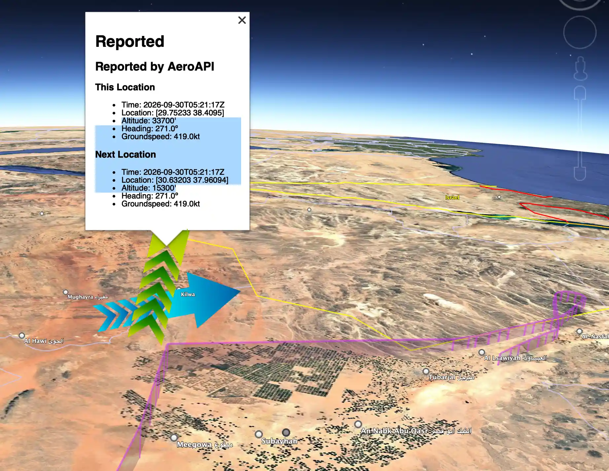
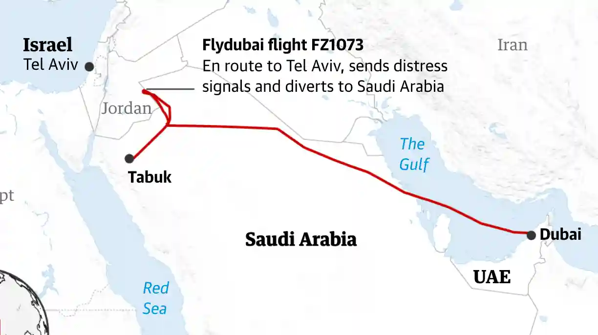

# FlyDubai to Tel Aviv — September 30th, 2026

This is the log of that miraculous — though almost tragic — flight from Dubai to Tel Aviv on September 30th, 2026.

- [Track on Flight Aware](https://www.flightaware.com/live/flight/FDB1073/history/20260930/0255Z/OMDB/LLBG)

Here are the relevant items:
- Tail number: `A6-FKF`
- Flight number: `1073`
- Departure: `3:05 UTC`

Since its tail number was `A6-FKF`, a command to get its tracks is:

```shell
$ fviz tracks --tailNumber A6-FKF --flightCount 1 --cutoffTime 2026-09-30T10:00:00-00:00 --launch
```

Zooming in and rotating a bit in the visualization (below), we see the last track point having the expected
altitude of 34,000 feet (at `05:20:37` UTC).  



The next track point shows the altitude starting to drop; then the track goes silent for 11 minutes...

A
[US News report](https://www.usnews.com/news/world/articles/2026-10-02/explainer-what-do-we-know-about-flydubai-flight-1073)
explains:

> At 0521 GMT in Saudi airspace it made a sudden, sharp turn and plunged towards the ground twice, before stabilising.
> The plane fell more than 16,000 feet in just over 30 seconds during its most dramatic dive.

When the track log picks up again, the plane appears to be flying level at around 15,000 feet. The last entry
observed in the track is at `5:52:02` UTC — about 6 minutes prior to landing at Tabuk, as reported in a news update: 


