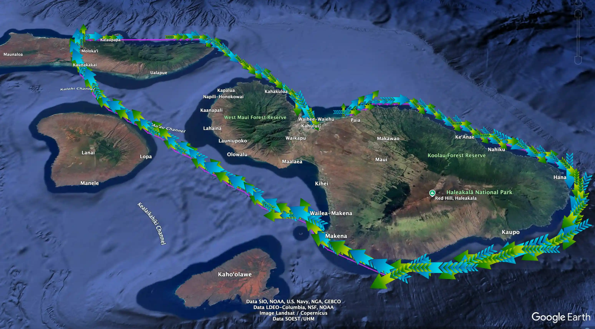

# Flight Visualizer Examples

Several preloaded flight track source files are supplied in the [artifacts](../../artifacts) folder.  Using these
artifacts, you can try out `flightvisualizer` to create KML files without an external source for flight track data.

Follow along below with an example invocation of `flightvisualizer` to view a fun Maui Island flyaround,
and check out some other featured visualizations.

### Maui Flyaround

Assuming both the saved "flight" (i.e.,
[fvf_N335SP_cutoff-20230523T220000Z.json](../../artifacts/fvf_N335SP_cutoff-20230523T220000Z.json))
and its referenced "track" artifact (i.e.,
[fvt_N335SP-1684874159-adhoc-1864p.json](../../artifacts/fvt_N335SP-1684874159-adhoc-1864p.json))
source artifact file(s) are present, you can generate and launch a visualization of a saved artifact
in this folder as demonstrated in the following example — try it yourself!

```shell
$ fviz tracks --artifactsDir artifacts --fromArtifacts fvf_N335SP_cutoff-20230523T220000Z.json --launch
2023/05/25 16:43:58 INFO: reading from file(artifacts/fvf_N335SP_cutoff-20230523T220000Z.json)
2023/05/25 16:43:58 INFO: reading from file(artifacts/fvt_N335SP-1684874159-adhoc-1864p.json)
2023/05/25 16:43:58 INFO: saving to file(artifacts/fvk__230523203550Z-22102Z_camera-path-vector.kmz)
2023/05/25 16:43:58 INFO: Launching 'artifacts/fvk__230523203550Z-22102Z_camera-path-vector.kmz' 
```

The command above generates a compressed KML flight track and opens up the flight track renderer (e.g.,
[Google Earth Pro]) enabling visualization of the overall flight path:



#### Notes

- Because the `--launch` option was used and [Google Earth Pro] is installed, the flight visualization shown
  above immediately loads and starts. 
- The `.kmz` (compressed KML file) file created can be loaded directly and played at any time in the future
  (e.g., using Google Earth's `File > Open` menu command, or using macOS' "open" command, such as for the
  example above: `open artifacts/fvk__230523203550Z-22102Z_camera-path-vector.kmz`).

Once the KML is loaded into Google Earth, use keyboard and mouse controls to zoom in and around — or even
"fly" — the flight path.  The visualization can even be recorded into a video by using the "Play Tour"
button appearing along the different track components appearing in the Google Earth "Places" sidebar.

### Other Examples

Other preloaded examples include:

- [Galactic 02](./galactic02.md)
- [Fly Dubai Miracle](./260930-flydubai.md)

[Google Earth Pro]: https://www.google.com/earth/versions/#earth-pro
[Google Earth]: https://www.google.com/earth/versions
