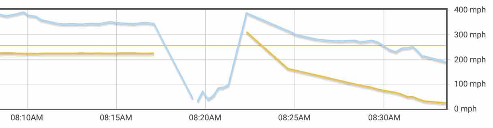
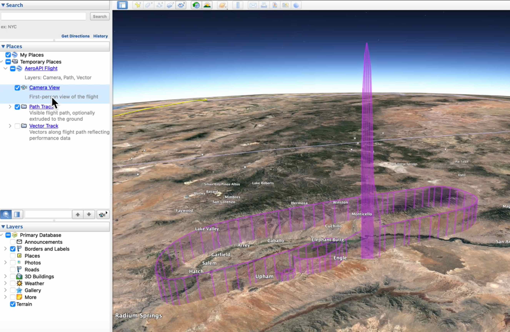
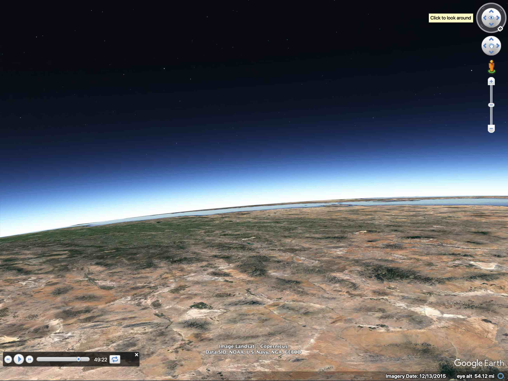

# Virgin [Galactic 02]

As I watched the livestream of [Virgin Galactic]'s second commercial
flight [on YouTube](https://www.youtube.com/results?search_query=galactic+02+spaceflight), I couldn't
help but wonder what its passengers were seeing out of the windows...

## Looking at the Data

After the flight concluded, I looked up its track log on [FlightAware], curious
to see how the unusual altitudes would be represented.  Not too surprisingly, altitudes
above controlled airspace (i.e., above 60,000' - `FL600`, the "cieling" of "Class A" airspace - where
no clear standard exists for reporting altitudes AFAIK) were just reported as `0` - i.e.,
missing values.

This was pretty clearly represented on their Altitude vs. Speed summary chart:



Another quickly evident "feature" of the track logs is that it doesn't capture
True Air Speed (TAS), only "Groundspeed".  Even though [SpaceShipTwo] was traveling 
at Mach 3 (through the atmosphere), over the ground she was going pretty slowly...

## Creating the Visualization

Because it was easy to find [SpaceShipTwo]'s "N" (aka "tail") number, being clearly visible in the livestream and
elsewhere across the Internet, formulating the `flightvisualizer` command was a nobrainer.

I opted to use the `--saveArtifacts` option since I realized (see above) that I'd need
to manually insert (a guess at) those missing altitudes above `FL600` which weren't available
in [FlightAware]'s response, in an intermediary step:

```shell
$ fviz tracks --saveArtifacts --flightCount 1 \
  --tailNumber N202VG --cutoffTime 2023-08-10T10:00:00-06:00
```

See the zero altitudes:
```shell
$ cat fvt_VGX3-1691670738-sw-1757p.json | jq -c ".positions[] | {altitude: .altitude, timestamp: .timestamp}" | more
...
{"altitude":448,"timestamp":"2023-08-10T15:17:07Z"}
{"altitude":0,"timestamp":"2023-08-10T15:19:17Z"}
{"altitude":0,"timestamp":"2023-08-10T15:19:33Z"}
{"altitude":0,"timestamp":"2023-08-10T15:19:51Z"}
{"altitude":0,"timestamp":"2023-08-10T15:20:09Z"}
{"altitude":0,"timestamp":"2023-08-10T15:20:26Z"}
{"altitude":0,"timestamp":"2023-08-10T15:20:44Z"}
{"altitude":0,"timestamp":"2023-08-10T15:21:00Z"}
{"altitude":0,"timestamp":"2023-08-10T15:21:17Z"}
{"altitude":620,"timestamp":"2023-08-10T15:22:18Z"}
...
```

After replacing the `0` values with those from an approximation of a parabolic
trajectory of the flight, confirming:

```shell
$ cat fvt_VGX3-1691670738-sw-1757p-withascent.json | jq -c ".positions[] | {altitude: .altitude, timestamp: .timestamp}" | more
...
{"altitude":448,"timestamp":"2023-08-10T15:17:07Z"}
{"altitude":1500,"timestamp":"2023-08-10T15:19:17Z"}
{"altitude":2350,"timestamp":"2023-08-10T15:19:33Z"}
{"altitude":2736,"timestamp":"2023-08-10T15:19:51Z"}
{"altitude":2858,"timestamp":"2023-08-10T15:20:09Z"}
{"altitude":2749,"timestamp":"2023-08-10T15:20:26Z"}
{"altitude":2590,"timestamp":"2023-08-10T15:20:44Z"}
{"altitude":2037,"timestamp":"2023-08-10T15:21:00Z"}
{"altitude":1218,"timestamp":"2023-08-10T15:21:17Z"}
{"altitude":620,"timestamp":"2023-08-10T15:22:18Z"}
...
```

## Launch the Visualization in Google Earth

Once the manual "fixup" of the [AeroAPI] track log was ready, the
visualization could be created & launched into [Google Earth]:

```shell
$ fviz tracks --launch --layers camera,path,vector \
  --fromArtifacts fvt_VGX3-1691670738-sw-1757p-withascent.json
```

Here are some screenshots I took during my visualization:

### Shape of the Path



It really was pretty amazing to see the "shape" of - and to be able to look around
while "flying" - the flight path by using the "Path Track" and "Camera Views."

It helped me to get a pretty clear view of the perspective the passengers had from their window.  

### View From The Top



The view from the apogee didn't match my expectations of "what Earth should look 
like from space," but it certainly was high up enough to give one pause - especially
I imagine if one was _physically there_ - and to end any argument about whether or
not Earth is flat!  ;-)

[Galactic 02]: https://en.wikipedia.org/wiki/Galactic_02
[SpaceShipTwo]: https://en.wikipedia.org/wiki/SpaceShipTwo
[FlightAware]: https://www.flightaware.com
[AeroAPI]: https://flightaware.com/commercial/aeroapi/
[Google Earth]: https://www.google.com/earth/versions
[Virgin Galactic]: (https://www.virgingalactic.com/)
